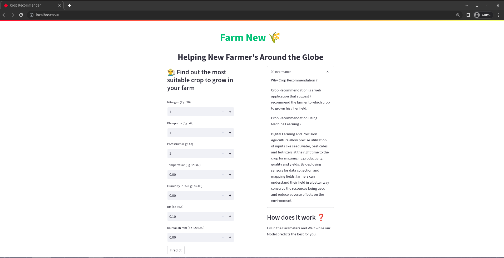

# Farm New

Crop recommendation is one of the most important aspects of precision agriculture. Crop recommendations are based on a number of factors.    Precision agriculture seeks to define these criteria on a site-by-site basis in order to address crop selection issues.    
Precision agriculture systems aren't all created equal.     
However, in agriculture, it is critical that the recommendations made are correct and precise, as errors can result in significant material and capital loss.

This application will assist farmers in increasing agricultural productivity, preventing soil degradation in cultivated land, reducing chemical use in crop production, and maximizing water resource efficiency.

---

### [Attributes information:]()

* **N** - Ratio of Nitrogen content in soil
* **P** - Ratio of Phosphorous content in soil
* **K** - Ratio of Potassium content in soil
* **Temperature** -  Temperature in degree Celsius
* **Humidity** - Relative humidity in %
* **pH** - pH value of the soil
* **Rainfall** - Rainfall in mm 

### [Experiment Results:]()
* **Data Analysis**
    * All columns contain outliers except for N.
 * **Training and Validation**
    * GausianNB gets a higher accuracy score than other classification models.
    * GaussianNB ( 99 % accuracy score )
 * **Performance Results**
    * Training Score: 99.5%
    * Validation Score: 99.3%

